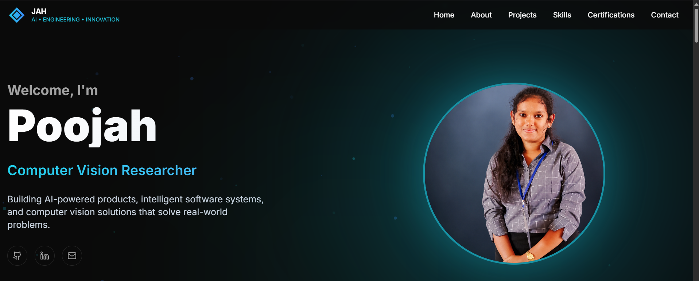

# 🌐 Poojah Yogarasa Portfolio

<div align="center">

### Computer Engineering Undergraduate | AI Enthusiast | Software Developer

🔗 **Live Portfolio:** https://poojah.vercel.app

[](https://poojah.vercel.app)
[](https://www.linkedin.com/in/poojah-yogarasa/)
[](https://github.com/poojahyogarasa)

</div>

---

## 👋 About Me

I'm **Poojah Yogarasa**, a Final-Year Computer Engineering Undergraduate at the **University of Jaffna** passionate about building intelligent systems, modern software solutions, and impactful AI-driven applications.

### Areas of Interest

- 🤖 Artificial Intelligence
- 👁️ Computer Vision
- 💻 Software Engineering
- 📊 Data Engineering
- 🧠 Machine Learning
- 🚀 Emerging Technologies

---

## ✨ Portfolio Highlights

- Modern Responsive Design
- Interactive Animations
- Professional Dark UI
- Project Showcase
- Skills & Technology Stack
- Experience Timeline
- Certifications Section
- Contact & Social Links
- Mobile-Friendly Experience

---

## 🛠️ Tech Stack

### Frontend


### UI & Design


### Deployment


---

## 🚀 Featured Projects

### 🤖 AI Career Copilot

An AI-powered career development platform designed to help students and job seekers improve their employability.

**Features**

- Resume Analysis
- ATS Score Evaluation
- Job Matching
- Skill Gap Analysis
- AI Interview Preparation
- Career Readiness Assessment

---

### 🔍 Weapons Detection Using CCTV Images

Final-Year Research Project focused on real-time weapon detection using Computer Vision and Deep Learning techniques.

**Technologies**

- YOLOv8
- Python
- OpenCV
- Computer Vision
- Deep Learning

---

### 🏥 Clinic Appointment Management System

Desktop application developed using modern software engineering principles.

**Technologies**

- C#
- .NET 8
- WPF
- MVVM Architecture
- SQLite

---

## 📸 Portfolio Preview



---

## ⚙️ Getting Started

### Clone Repository

```bash
git clone https://github.com/poojahyogarasa/poojah-portfolio.git
```

### Navigate to Project

```bash
cd poojah-portfolio
```

### Install Dependencies

```bash
npm install
```

### Run Development Server

```bash
npm run dev
```

Open:

```text
http://localhost:3000
```

---

## 🌍 Live Demo

🔗 **https://poojah.vercel.app**

---

## 📫 Connect With Me

- Portfolio: https://poojah.vercel.app
- LinkedIn: https://www.linkedin.com/in/poojah-yogarasa/
- GitHub: https://github.com/poojahyogarasa

---

## 💡 Personal Motto

> Transforming ideas into intelligent solutions through engineering, innovation, and continuous learning.

---

<div align="center">

⭐ If you found this portfolio inspiring, consider giving the repository a star!

</div>
